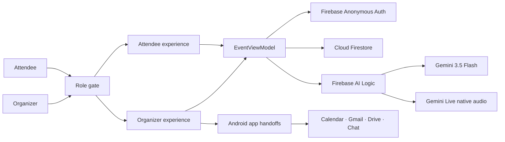

# Event Concierge

### A calm, voice-first companion for the busiest moments of an event

[](https://developer.android.com/)
[](https://kotlinlang.org/)
[](https://ai.google.dev/)
[](https://firebase.google.com/)


> Built for the Google AI Studio track at the
> [Stanford x DeepMind Hackathon: Build with Google Gemini](https://luma.com/e51fygtm),
> presented by GDG Stanford and hosted with Google DeepMind.

## Watch the demo

| Full product demo | One-minute Short |
| --- | --- |
| [](https://youtu.be/O7tzNWv-QZw) | [](https://youtube.com/shorts/jw46EdWIypQ) |
| [Watch the full demo on YouTube](https://youtu.be/O7tzNWv-QZw) | [Watch the Short on YouTube](https://youtube.com/shorts/jw46EdWIypQ) |

Event Concierge gives everyone at an event the right kind of help without
turning the evening into another dashboard. Attendees get a warm, private
concierge. Organizers get a focused operational view. Gemini makes the
conversation feel natural while Firebase keeps the shared event state connected.

## The idea

Hosts spend too much of an event answering the same questions:

- Where do I park?
- What happens next?
- Is there a vegan option?
- Has the VIP guest arrived?
- Which issue needs attention right now?

Event Concierge handles those small, repeated moments so the host can stay
present with people. The product has two intentionally separate experiences:

| Attendee experience | Organizer experience |
| --- | --- |
| Ask questions by voice or text | See attendance and VIP arrival summaries |
| View the event schedule | Review the full guest roster |
| Find parking, rooms, food, and accessibility information | Track and resolve operational issues |
| Complete a privacy-safe self check-in | Read guest notes and arrival signals |
| Send a note or wave to the host | Generate a concise event briefing |

## Gemini is the concierge

Gemini is part of the product flow, not a decorative chatbot:

- **Gemini 3.5 Flash** answers typed event questions through Firebase AI Logic.
- **Gemini Live native audio** supports low-latency, two-way voice conversations.
- A grounded system instruction limits answers to known event facts and avoids
  inventing guest information.
- A small deterministic answer layer keeps essential event guidance available if
  the model or network is temporarily unavailable.
- **Google AI Studio** was used to prototype the product quickly before the
  Android project was exported, refined, connected, and tested locally.

## How it works



The Android UI updates immediately from local state. Operational actions are
also written to Firestore, while Gemini requests travel through Firebase AI
Logic so the app does not embed a raw Gemini API credential.

## Technology

| Layer | Choice | Why it fits |
| --- | --- | --- |
| Mobile | Native Android, Kotlin | Direct access to audio, permissions, and installed Google apps |
| UI | Jetpack Compose, Material 3 | Fast iteration with accessible, adaptive components |
| State | `EventViewModel` | One small state holder for the hackathon-sized app |
| Intelligence | Gemini 3.5 Flash | Fast, concise answers for live event questions |
| Voice | Gemini Live native audio | Natural, low-latency conversation |
| AI gateway | Firebase AI Logic | Client SDK, App Check support, and protected Gemini access |
| Identity | Firebase Anonymous Auth | Frictionless prototype sessions |
| Data | Cloud Firestore | Shared check-ins, activity, notes, and issues |
| Abuse protection | Firebase App Check | Restricts AI access to registered development devices |
| Google apps | Android intents | User-confirmed Calendar, Gmail, Drive, and Chat handoffs |
| Quality | JUnit, Android lint, Gradle | Repeatable local build and validation |

## Design language

The interface is meant to feel like a thoughtful event card:

- warm cream surfaces;
- amber, sage, and muted-blue accents;
- rounded cards with restrained shadows;
- generous touch targets and readable contrast;
- a slightly playful layout without a dense enterprise-dashboard feeling;
- reduced-motion-aware Compose animations.

The attendee and organizer navigation trees are separate after role selection,
so neither experience leaks into the other during the session.

## Run it locally

### Requirements

- Android Studio
- Android SDK 36
- An Android 7.0 / API 24 or newer emulator or device
- A Firebase project with Authentication, Firestore, Firebase AI Logic, and App
  Check enabled

### Setup

1. Clone the repository:

   ```bash
   git clone https://github.com/kaddynator/event-concierge-role-split.git
   cd event-concierge-role-split
   ```

2. Register package `com.aistudio.eventconcierge.qxwpzl` as an Android app in
   your Firebase project.
3. Download your Firebase configuration to `app/google-services.json`.
4. Enable Anonymous Authentication and create a Firestore database.
5. Deploy [`firestore.rules`](firestore.rules).
6. Enable Firebase AI Logic with the Gemini Developer API.
7. For a debug build, register the App Check debug token printed in Logcat.
8. Open the project in Android Studio and run the `app` configuration.

Or build from the terminal:

```bash
./gradlew testDebugUnitTest assembleDebug lintDebug
```

## What is working

- Separate attendee and organizer interfaces
- Gemini-powered typed concierge answers
- Gemini Live voice session with microphone input and audio output
- Anonymous Firebase sessions
- Firestore activity, check-in, message, and issue writes
- Calendar event handoff
- Gmail organizer-update draft
- Shareable briefing file for Drive, Chat, and other Android apps
- Successful build, unit-test, lint, and physical Samsung-device smoke tests

## Prototype boundaries

This is a working hackathon MVP. The role gate separates the interfaces but is
not yet a production authorization boundary. The sample roster and event facts
are local demo data, while operational actions are mirrored to Firestore.

Before a public production launch:

1. replace anonymous sessions with Google sign-in;
2. store roles in protected profiles or custom claims;
3. enforce those roles in Firestore Security Rules;
4. replace the App Check debug provider with Play Integrity;
5. move organizer-managed event content fully into Firestore;
6. use direct Google Workspace APIs only if background synchronization becomes
   more valuable than the current user-confirmed handoffs.

## The next lovely version

- Let organizers create an event from a Google Calendar entry or event brief.
- Generate an attendee-ready knowledge base from Drive documents.
- Push urgent organizer updates to the concierge in real time.
- Support multilingual voice conversations.
- Add post-event summaries for attendance, common questions, and issue patterns.

---

Built in one focused sprint with Google AI Studio, Gemini, Firebase, Android,
and a belief that event software can feel more like hospitality.
